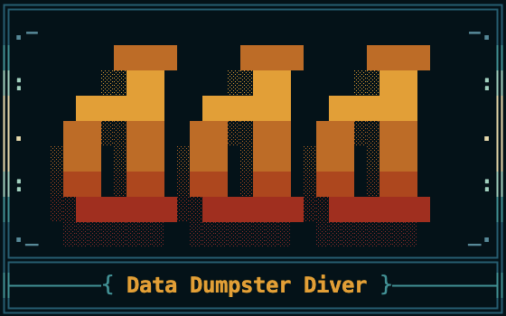

# Data Dumpster Diver



[](https://github.com/Datal0re/ddd) [](LICENSE) [](https://nodejs.org/)

A wizard-guided CLI tool for processing and exploring exported ChatGPT conversation data. Transform ZIP exports into organized, searchable collections with extracted media assets.

## Why Use Data Dumpster Diver?

**🔄 Account Migration**: Export conversations from one OpenAI account and feed them to another for context continuity.

**📚 Knowledge Management**: Create Obsidian Vaults with your ChatGPT conversations for personal knowledge bases.

**📝 Content Creation**: Export conversations as HTML for blog posts, documentation, or sharing.

**💾 Data Backup**: Preserve conversations in an organized, searchable format outside the volatile AI ecosystem.

**🔬 Research Processing**: Extract and organize chat data for model training, analysis, or research purposes.

## 🚀 Quick Start

**NOTE** \
Before using ddd, make sure to grab a ChatGPT data export!
> _Check out [OpenAI's help page](https://help.openai.com/en/articles/7260999-how-do-i-export-my-chatgpt-history-and-data) for details on how to get yours._

### Installation

```bash
git clone https://github.com/Datal0re/ddd.git && cd ddd
npm install
npm link  # Optional: make CLI globally available
```

### Basic Usage

All commands are interactive - omit arguments and you'll be guided:

```bash
# Process ChatGPT export
ddd dump chatgpt-export.zip --name "my-chats"
ddd dump  # Interactive mode

# View all processed dumpsters
ddd hoard
ddd hoard --verbose

# Search and select chats
ddd rummage
ddd rummage my-chats  # Skip dumpster selection

# Export to various formats
ddd upcycle html my-chats --include-media
ddd upcycle txt  # Interactive: prompts for format & source

# Manage selection bins
ddd bin create my-bin
ddd bin list

# Safely delete dumpsters
ddd burn my-chats --dry-run  # Preview
ddd burn --force             # Skip confirmation
```

## Commands Overview

### `dump [file]`

Process ChatGPT export ZIP files into organized collections.

```bash
ddd dump <path-to-zip> [options]
ddd dump  # Interactive mode
```

**Options**: `-n, --name <name>`, `-v, --verbose`

### `hoard`

View all processed dumpsters with statistics.

```bash
ddd hoard [options]
```

**Options**: `-v, --verbose` for detailed information

### `rummage [dumpster-name]`

Advanced 8-step wizard for searching and selecting chats.

```bash
ddd rummage <dumpster-name> [options]
ddd rummage  # Full wizard experience
```

**Features**: Search by content/titles, relevance scoring, persistent selection bins, multi-select interface

### `upcycle [format] [dumpster-name]`

Export collections to various formats.

```bash
ddd upcycle <format> <dumpster-name> [options]
ddd upcycle  # Interactive: format → source → options
```

**Export Sources**: Entire dumpster, selection bin, or individual chats
**Formats**: `txt`, `md`, `html`
**Options**: `-o, --output <path>`, `--include-media`, `--self-contained`, `-v, --verbose`

### `bin [subcommand] [name]`

Manage persistent selection bins for organizing chat selections.

```bash
ddd bin create <name>    # Create new bin
ddd bin list             # List all bins
ddd bin rename <old> <new> # Rename bin
ddd bin empty <name>     # Clear bin contents
ddd bin burn <name>      # Delete bin permanently
```

### `burn [dumpster-name]`

Safely delete dumpsters with multi-step confirmation.

```bash
ddd burn <dumpster-name> [options]
ddd burn  # Interactive mode
```

**Options**: `-f, --force` (skip confirmation), `--dry-run` (preview)

## Data Organization

Processed exports are stored in structured collections:

```text
data/
├── dumpsters/          # Processed chat collections
│   └── {name}/
│       ├── chats/      # Individual chat files
│       └── media/     # Extracted assets
├── bins.json          # Selection bin metadata
├── dumpsters.json     # Collection registry
└── temp/              # Temporary files (auto-cleaned)
```

## Security

- **Path Traversal Protection** against malicious file paths
- **ZIP Bomb Protection** with compression ratio validation
- **Size Limits** (500MB upload, 2GB extracted)
- **Input Validation** throughout the application
- **Multi-step Confirmations** for destructive operations

## Testing

Comprehensive shell-based test suite for realistic CLI validation:

```bash
npm test                # Main test suite
npm run test:basic      # Basic functionality
npm run test:workflows  # End-to-end workflows
npm run test:integration # Wizard workflow testing
npm run test:with-logs  # Tests with detailed output

# Test data management
npm run test:setup      # Generate synthetic test data
npm run test:cleanup    # Clean up test artifacts
```

**Test Approach**: Shell scripts validate actual CLI behavior with synthetic ChatGPT export data for consistent testing.

## 📦 Requirements

- **Node.js**: >=14.0.0
- **Key Dependencies**: @inquirer/prompts, commander, decompress, chalk, ora
- **Platform**: macOS, Linux, Windows (with WSL recommended)

## 🤝 Contributing

Contributions are welcome! Please:

1. Follow the development guidelines in [AGENTS.md](AGENTS.md)
2. Maintain consistent code style (ESLint + Prettier)
3. Add comprehensive tests for new features
4. Ensure interactive prompts work correctly

## 📄 License

MIT License - see [LICENSE](LICENSE) file for details.

## 🔗 Links

- **[Development Guide](AGENTS.md)** - Architecture, development setup, and contributing
- **[Changelog](CHANGELOG.md)** - Version history and feature evolution
- **[Issues](https://github.com/Datal0re/ddd/issues)** - Report bugs and request features

---
